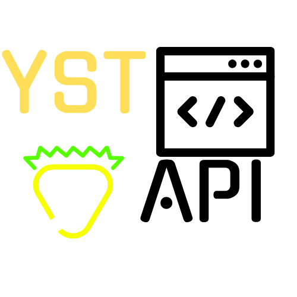
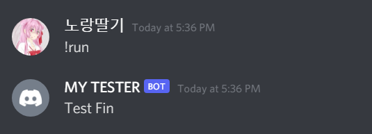
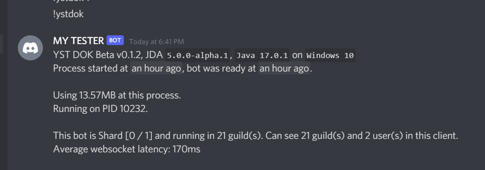
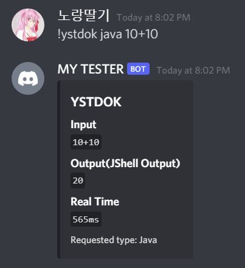
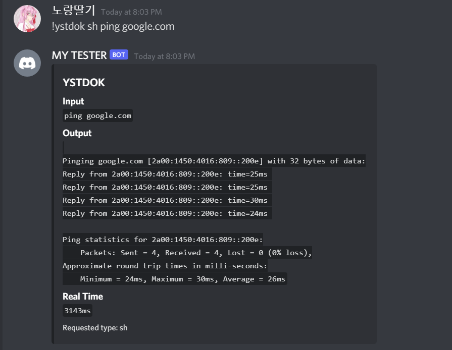

 
# YST API - 노랑딸기 API

## ❓How to use? / 어떻게 쓰나요?

### **Logging - 로깅에 대한 기능**

<pre>
<code>
package cf.ystapi.explains.Logging;

import cf.ystapi.Logging.*;

import java.io.IOException;
import java.util.Random;

public class Main {
    static Logger logger;
    public static void main(String[] args) throws IOException {
        LoggingBuilder loggingBuilder = new LoggingBuilder();
        loggingBuilder.setFormat("[%YY/%MM/%DD %HH:%mm:%SS | %LL] %MSG");
        loggingBuilder.useWebLogger(true);
        logger = loggingBuilder.build("wow");
        logger.error("wow");
        logger.warn("woow");
        logger.info("wooow");
        logger.debug("woooow");
        System.out.println(1);
        System.out.println();
        new Thread(() -> {
            while (true){
                logger.log(String.valueOf(new Random().nextInt(2147892)), new Random().nextInt(4));
                try {
                    Thread.sleep(1000);
                } catch (InterruptedException e) {
                    e.printStackTrace();
                }
            }
        }).start();
    }
}
</code>
</pre>

### **JDA - JDA에 대한 기능**

<메인 클래스>
<pre>
<code>
package cf.ystapi.explains.jda;

import cf.ystapi.explains.jda.CommandHandlers.first;
import cf.ystapi.jda.Objects.DiscordBot;
import cf.ystapi.jda.YSTBuilder;
import net.dv8tion.jda.api.JDABuilder;

import javax.security.auth.login.LoginException;

public class bot {
    public static DiscordBot discordBot;
    public static void main(String[] args) throws LoginException {
        JDABuilder jdaBuilder = JDABuilder.createDefault("Token");
        YSTBuilder builder = new YSTBuilder(jdaBuilder.build());
        builder.addCommand(new first()).addCommand("run", (event, args1, channel) -> {
            channel.sendMessage("Test Fin").queue();
        })
                .setPrefix("!").setOwner("719932404877230140");

        discordBot = builder.build();
    }
}

</code>
</pre>

<first.java>
<pre>
<code>
package cf.ystapi.explains.jda.CommandHandlers;

import cf.ystapi.jda.Handlers.CommandHandler;
import net.dv8tion.jda.api.entities.MessageChannel;
import net.dv8tion.jda.api.events.message.MessageReceivedEvent;

public class first implements CommandHandler {
    @Override
    public String name() {
        return "test";
    }

    @Override
    public String helpMessages() {
        return null;
    }

    @Override
    public void onCalled(MessageReceivedEvent event, String[] args, MessageChannel channel) {
        channel.sendMessage("Hello World!").queue();
    }
}

</code>
</pre>

!ystdok

### **Util 기타 기능**
 

#### Arg:

<pre>
<code>
package cf.ystapi.explains.util;

import cf.ystapi.util.arg;

public class arg_ex {
    public static void main(String[] args) {
        String[] ar = arg.spconvert("Hi! Hello");

        //Output = Hi!
        System.out.println(ar[0]);

        //Output = Hello
        System.out.println(ar[1]);
    }
}

</code>
</pre>

#### Json Reader:

<pre>
<code>
package cf.ystapi.explains.util;

import cf.ystapi.util.JsonReader;
import org.json.JSONObject;

import java.io.IOException;

public class jsonreader_ex {
    public static void main(String[] args) {
        try {
            JSONObject j = JsonReader.ReadFromUrl("URL");
        } catch (IOException e) {
            e.printStackTrace();
        }
    }
}
</code>
</pre>

### **Event - 이벤트** 

#### Main:
<pre>
<code>
package cf.ystapi.explains.event;

import cf.ystapi.events.Manager;

public class main {
    public static void main(String[] args){
        //AddListener for the api
        Manager m = new Manager();
        m.addListener(new event());
    }
}

</code>
</pre>

#### Event:

<pre>
<code>
package cf.ystapi.explains.event;

import cf.ystapi.events.DateEvent;

public class event implements DateEvent {
    int sec = 0;
    int min = 0;
    @Override
    public void OnSecondChange() {
        sec++;
        if(sec == 60)
            sec = 0;
        System.out.println(sec);
    }

    @Override
    public void OnMinuteChange() {
        min++;
        System.out.println(min);
    }
}
</code>
</pre>

 

## 📋Used Apis(Libraries) / 이 API에서 쓴 라이브러리

Json API(org.json) 
JDA(Java Discord Api) 

## 📝 Events in this Api / 여기에 있는 이벤트

Change Event - 변경 이벤트 
ㄴ Dateevnet 
&nbsp;&nbsp;&nbsp;&nbsp;&nbsp;ㄴ OnSecondChange() - void 
&nbsp;&nbsp;&nbsp;&nbsp;&nbsp;ㄴ OnMinuteChange() - void 
&nbsp;&nbsp;&nbsp;&nbsp;&nbsp;ㄴ OnHourChange() - void 
&nbsp;&nbsp;&nbsp;&nbsp;&nbsp;ㄴ OnDateChange() - void 
&nbsp;&nbsp;&nbsp;&nbsp;&nbsp;ㄴ OnWeekChange() - void 
&nbsp;&nbsp;&nbsp;&nbsp;&nbsp;ㄴ OnYearChange() - void 
