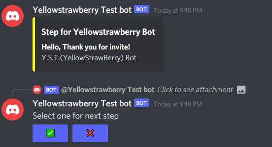

# YST API - 노랑딸기 API

## ❓How to use? / 어떻게 쓰나요?

### **Event - 이벤트** 

#### Main:
<pre>
<code>
package cf.ystapi.explains.event;

import cf.ystapi.events.Manager;

public class main {
    public static void main(String[] args){
        //AddListener for the api
        Manager m = new Manager();
        m.addListener(new event());
    }
}

</code>
</pre>

#### Event:

<pre>
<code>
package cf.ystapi.explains.event;

import cf.ystapi.events.DateEvent;

public class event implements DateEvent {
    int sec = 0;
    int min = 0;
    @Override
    public void OnSecondChange() {
        sec++;
        if(sec == 60)
            sec = 0;
        System.out.println(sec);
    }

    @Override
    public void OnMinuteChange() {
        min++;
        System.out.println(min);
    }
}
</code>
</pre>

 

### **JDA - JDA에 대한 기능**

<pre>
<code>
package cf.ystapi.explains.jda;

import cf.ystapi.jda.Embed;
import net.dv8tion.jda.api.EmbedBuilder;
import net.dv8tion.jda.api.entities.Guild;
import net.dv8tion.jda.api.entities.Message;
import net.dv8tion.jda.api.entities.TextChannel;
import net.dv8tion.jda.api.events.interaction.ButtonClickEvent;
import net.dv8tion.jda.api.events.message.MessageReceivedEvent;
import net.dv8tion.jda.api.hooks.ListenerAdapter;
import net.dv8tion.jda.api.interactions.components.Button;
import org.jetbrains.annotations.NotNull;

public class embed extends ListenerAdapter {
    @Override
    public void onMessageReceived(@NotNull MessageReceivedEvent event) {
        if(event.getMessage().getContentRaw().equals("!test")){

            //Create Embed
            EmbedBuilder e = new EmbedBuilder().setTitle("Test")
                    .addField("TEST","TEST",false);

            //Get Text Channel
            TextChannel t = event.getTextChannel();

            //Create Buttons
            Button b1 = Button.primary("Hi", "Click Me");
            Button b2 = Button.primary("Hi1", "Click Me!");

            //Send Message
            event.getChannel().sendMessage(e.build()).queue(
                    //AddButton
                    message -> Embed.addButton(
                        //Set Text
                        t,
                        //Set Message Id
                        message.getId(),
                        "Select:",
                        //set Buttons
                        b1,
                        b2
                    ));
        }
    }
}
</code>
</pre>
 

### **Util 기타 기능**
 

#### Arg:

<pre>
<code>
package cf.ystapi.explains.util;

import cf.ystapi.util.arg;

public class arg_ex {
    public static void main(String[] args) {
        String[] ar = arg.spconvert("Hi! Hello");

        //Output = Hi!
        System.out.println(ar[0]);

        //Output = Hello
        System.out.println(ar[1]);
    }
}

</code>
</pre>

#### Json Reader:

<pre>
<code>
package cf.ystapi.explains.util;

import cf.ystapi.util.JsonReader;
import org.json.JSONObject;

import java.io.IOException;

public class jsonreader_ex {
    public static void main(String[] args) {
        try {
            JSONObject j = JsonReader.ReadFromUrl("URL");
        } catch (IOException e) {
            e.printStackTrace();
        }
    }
}
</code>
</pre>

## 📋Used Apis(Libraries) / 이 API에서 쓴 라이브러리

Json API(org.json)
JDA(Java Discord Api) 

## 📝 Events in this Api / 여기에 있는 이벤트

Change Event - 변경 이벤트 
ㄴ Dateevnet 
&nbsp;&nbsp;&nbsp;&nbsp;&nbsp;ㄴ OnSecondChange() - void 
&nbsp;&nbsp;&nbsp;&nbsp;&nbsp;ㄴ OnMinuteChange() - void 
&nbsp;&nbsp;&nbsp;&nbsp;&nbsp;ㄴ OnHourChange() - void 
&nbsp;&nbsp;&nbsp;&nbsp;&nbsp;ㄴ OnDateChange() - void 
&nbsp;&nbsp;&nbsp;&nbsp;&nbsp;ㄴ OnWeekChange() - void 
&nbsp;&nbsp;&nbsp;&nbsp;&nbsp;ㄴ OnYearChange() - void 
